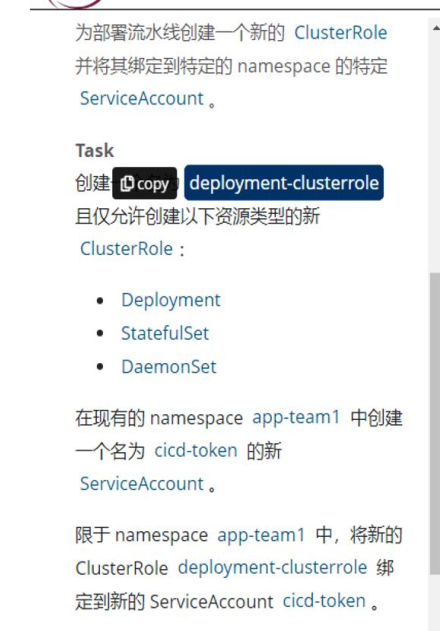
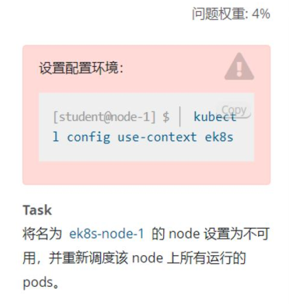
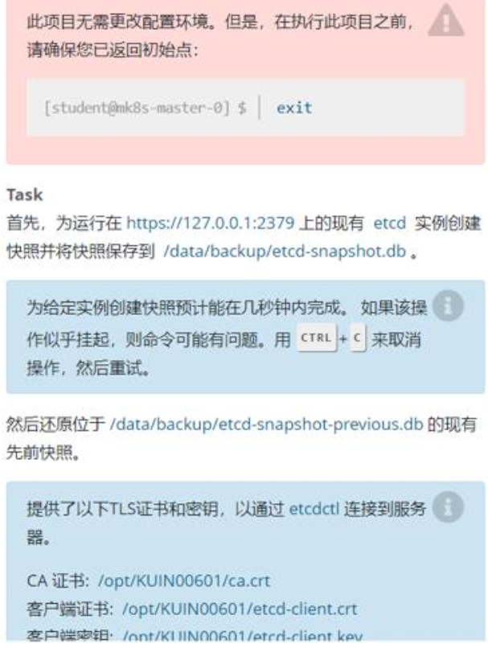
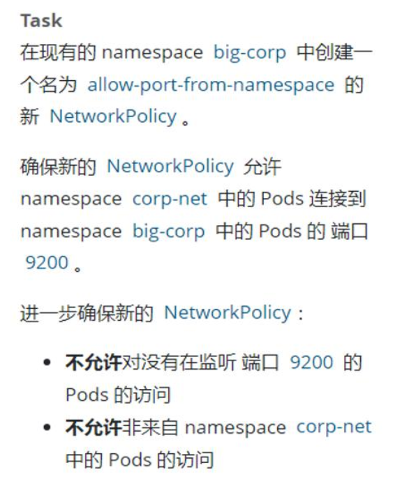
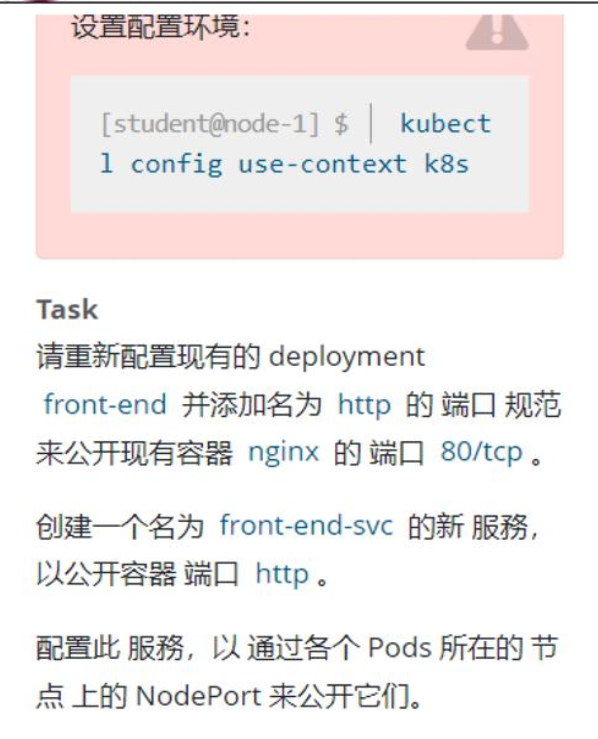

# CKA考试笔记

## 第一题: RBAC 授权（问题权重4%）

执行`kubectl config use-context k8s`




### 答案:

```bash
# 切换到名为k8s的集群
kubectl config use-context k8s

# 在命名空间app-team1中创建服务账号cicd-token
kubectl create serviceaccount cicd-token -n app-team1

# 查看账号是否创建
kubectl get serviceaccount cicd-token -n app-team1 

# 查看服务账户详情
kubectl describe sa cicd-token -n app-team1 

# 创建ClusterRole(集群角色)deployment-clusterrole,权限限定为:只允许创建deployments,daemonsets,statefulsets
kubectl create clusterrole deployment-clusterrole --verb=create -- resource=deployments,statefulsets,daemonsets

# 查看集群角色是否创建成功
kubectl get clusterrole |grep deployment-clusterrole

# 查看集群角色详情
kubectl describe clusterrole deployment-clusterrole

## 将集群角色绑定到账号
## {binding_NAME}=用户名-集群角色名-binding
kubectl create rolebinding {binding_NAME} -- clusterrole={集群角色名} --serviceaccount={命名空间名}:{用户名} -n {命名空间名}

# 在命名空间app-team1中,将ClusterRole(集群角色)deployment-clusterrole绑定到账号cicd-token
kubectl create rolebinding cicd-token-deployment-clusterrole-binding -- clusterrole=deployment-clusterrole --serviceaccount=app-team1:cicd-token -n app-team1

## 有可能是绑定clusterrolebinding
kubectl create clusterrolebinding cicd-token-deployment-clusterrole-binding --clusterrole=deployment-clusterrole --serviceaccount=app-team1:cicd-token -n app-team1

# 查看账号绑定成功,验证rolebinding资源
kubectl describe rolebinding cicd-token-deployment-clusterrole-binding -n app-team1
```


## 第二题 节点设置不可用（问题权重： 4%）  



### 答案

```bash
# 切换到名为ek8s的集群
kubectl config use-context ek8s

# 查看node状态
kubectl get nodes

# 将node标记为不可调度状态
kubectl cordon ek8s-node-1

# 驱逐节点上的所有pod(腾空节点)
## 节点排水(驱逐节点上的所有pod)
## 忽略节点上不能杀死的特定系统Pod,例如:CNI插件,daemonSet
## --delete-local-data 清空本地数据
## --ignore-daemonsets 忽略daemonsets错误
## --force 强制执行
kubectl drain ek8s-node-1 --delete-local-data --ignore-daemonsets --force

# 查看node状态
kubectl get nodes

# 查看污点
kubectl describe nodes node名 |grep Taints
# Taints:   node.kubernetes.io/unreachable:NoSchedule

```


## 第三题 升级 K8s 版本（问题权重： 7%）  

现有的Kubernetes集权正在运行的版本是`1.22.0`，仅将主节点上的所有kubernetes控制面板和组件升级到版本`1.22.2`   另外，`在主节点上升级kubelet和kubectl`


### 答案:

```bash
# 查看node版本
kubectl get node

# 查看kubeadm版本
kubeadm version

# 查看kubelet版本
kubelet version

# 切换到ek8s集群
kubectl config use-context ek8s

# 指定节点为不可调度
kubectl cordon k8s-master-0

# 驱逐节点上的所有pod(腾空节点)
kubectl darin k8s-master-0 --ignore-daemonsets

# 升级kubeadm,kubelet,kubectl
## ubuntu升级kubeadm,kubelet和kubectl到1.22.2
apt update && apt-mark unhold kubeadm kubelet kubectl && \ 
apt install kubeadm=1.22.2-00 kubelet=1.22.2-00 kubectl=1.22.2-00 --allow-change-held-packages -y && \ 
apt-mark hold kubeadm kubelet kubectl

## Centos升级kubeadm,kubelet和kubectl到1.22.2
yum install -y kubeadm=1.22.2-00 kubelet=1.22.2-00 kubectl=1.22.2-00

# 验证升级计划
kubeadm upgrade plan

# 升级k8s到1.20.1版本,且不升级etcd
kubeadm upgrade apply v1.22.2 --etcd-upgrade=false

# 重启kubelet服务
sudo systemctl daemon-reload
sudo systemctl restart kubelet

# 解除节点保护,将节点标记为可调度
kubectl uncordon k8s-master-0

# 确认node节点的版本
kubectl get node
```


## 第四题 etcd 备份与恢复（问题权重： 7%）  



### 答案

```bash
# 备份etcd
ETCDCTL_API=3 
etcdctl \
--endpoints=127.0.0.1:2379 \
--cacert=/opt/KUIN00601/ca.crt \
--cert=/opt/KUIN00601/etcd-client.crt \
--key=/opt/KUIN00601/etcd-client.key \
snapshot save /var/lib/backup/etcd-snapshot.db

# etcd还原
1.⾸先将etcd、api停⽌了，移动静态pod⽂件后，过了⼀会容器会⾃动停⽌，
mv /etc/kubernetes/manifests /etc/kubernetes/manifests.bak

2.备份⼀下原来etcd的⽂件夹
mv /var/lib/etcd /var/lib/etcd.bak

3.恢复数据
ETCDCTL_API=3
etcdctl --endpoints=https://127.0.0.1:2379 \
snapshot restore /data/backup/etcd-snapshot-previous.db --data-dir=/var/lib/etcd

4.启动etcd、api容器，把静态pod⽂件夹移回来 过⼀会就可以启动了
mv /etc/kubernetes/manifests.bak /etc/kubernetes/manifests

5.验证集群、pod资源状态
kubectl get nodes
kubectl get pods
```

## 第五题 网络策略（问题权重： 7%）  



###  答案

```bash
# 切换到指定k8s集群
kubectl config use-context hk8s

# 编辑资源清单
vi networkpolicy.yaml
```

编辑资源清单

```yaml
apiVersion: networking.k8s.io/v1
kind: NetworkPolicy
metadata:
 name: allow-port-from-namespace
 namespace: corp-net
spec:
 podSelector: {} 
 policyTypes:
 - Ingress
 ingress:
 - from:
 - namespaceSelector:
 matchLabels:
 name: big-corp
 ports:
 - protocol: TCP
 port: 9200
```

apply资源清单

```bash
# 应用资源清单
kubectl apply -f networkpolicy.yaml
```


## 第六题 SVC 暴露应用(问题权重： 7%)  



## 答案

```bash
# 切换到指定集群
kubectl config use-context k8s

# 查看修改deployment front-end的配置
kubectl edit deployment front-end
```

```yaml
…
 containers:
 - image: nginx
 imagePullPolicy: Always
 name: nginx
 ports:
 - name: http
 protocol: TCP
 containerPort: 80
…
```

暴露service

```bash
# 暴露svc
kubectl expose deployment front-end --port=80 --target-port=80 --type=
NodePort --name=front-end-svc

# 验证svc是否暴露
kubectl get svc front-end-svc
```

