# CKA考试笔记

## 第一题: RBAC 授权（问题权重4%）

执行`kubectl config use-context k8s`


### 答案:

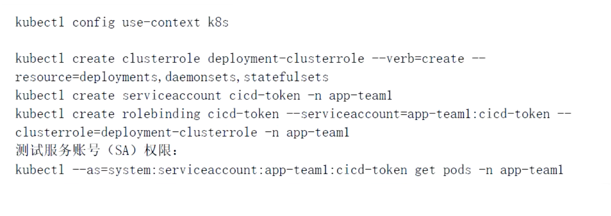


```bash
# 切换到名为k8s的集群
kubectl config use-context k8s

# 创建ClusterRole(集群角色)deployment-clusterrole,权限限定为:只允许创建deployments,daemonsets,statefulsets
kubectl create clusterrole deployment-clusterrole --verb=create -- resource=deployments,statefulsets,daemonsets

# 在命名空间app-team1中创建服务账号cicd-token
kubectl create serviceaccount cicd-token -n app-team1

# 在命名空间app-team1中,将ClusterRole(集群角色)deployment-clusterrole绑定到账号cicd-token
kubectl create rolebinding cicd-token-deployment-clusterrole-binding -- clusterrole=deployment-clusterrole --serviceaccount=app-team1:cicd-token -n app-team1
## 将集群角色绑定到账号
## {binding_NAME}=用户名-集群角色名-binding
kubectl create rolebinding {binding_NAME} -- clusterrole={集群角色名} --serviceaccount={命名空间名}:{用户名} -n {命名空间名}

# 测试服务账号权限
kubectl --as=system:serviceaccount:app-team1:cicd-token get pods -n app-team1

# 查看服务账户详情
kubectl describe sa cicd-token -n app-team1 

# 查看集群角色详情
kubectl describe clusterrole deployment-clusterrole

# 查看账号绑定成功,验证rolebinding资源
kubectl describe rolebinding cicd-token-deployment-clusterrole-binding -n app-team1
```


## 第二题 节点设置不可用（问题权重： 4%）  


### 答案

```bash
# 切换到名为ek8s的集群
kubectl config use-context ek8s

# 查看node状态
kubectl get nodes

# 设置节点不可用并驱逐节点上的所有pod(腾空节点)
## 节点排水(驱逐节点上的所有pod)
## 忽略节点上不能杀死的特定系统Pod,例如:CNI插件,daemonSet
## --delete-local-data 清空本地数据
## --ignore-daemonsets 忽略daemonsets错误
## --force 强制执行
kubectl drain ek8s-node-1 --ignore-daemonsets --force # 考试执行
## 如果报错,加--delete-local-data 清空本地数据
kubectl drain ek8s-node-1 --delete-local-data --ignore-daemonsets --force # 练习执行

# 查看node状态
kubectl get nodes

# 查看污点
kubectl describe nodes node名 |grep Taints
# Taints:   node.kubernetes.io/unreachable:NoSchedule
```


## 第三题 升级 K8s 版本（问题权重： 7%）  

现有的Kubernetes集权正在运行的版本是`1.22.0`，仅将主节点上的所有kubernetes控制面板和组件升级到版本`1.22.2`   另外，`在主节点上升级kubelet和kubectl`


### 答案:

```bash
# 查看node版本
kubectl get node

# 查看kubeadm版本
kubeadm version

# 查看kubelet版本
kubelet version

# 切换到ek8s集群
kubectl config use-context ek8s

# 标记节点为不可调度并驱逐节点上的所有pod(节点排水)
kubectl drain k8s-master-0 --ignore-daemonsets

# 升级kubeadm到指定版本
apt update && apt-mark unhold kubeadm && apt install kubeadm=1.22.2-00

# 验证升级计划
kubeadm upgrade plan

# 升级k8s到1.20.1版本,且不升级etcd
kubeadm upgrade apply v1.22.2 --etcd-upgrade=false

# kubelet,kubectl
## 取消apt的包版本锁定
apt update && apt-mark unhold kubelet kubectl
## ubuntu升级kubelet和kubectl到1.22.2
apt install kubelet=1.22.2-00 kubectl=1.22.2-00 --allow-change-held-packages -y
## 锁定kubelet和kubectl版本
apt-mark hold kubelet kubectl

## Centos升级kubeadm,kubelet和kubectl到1.22.2
yum install -y kubeadm=1.22.2-00 kubelet=1.22.2-00 kubectl=1.22.2-00

# 重启kubelet服务
sudo systemctl daemon-reload
sudo systemctl restart kubelet

# 解除节点保护,将节点标记为可调度
kubectl uncordon k8s-master-0

# 确认node节点的版本
kubectl get node
```


## 第四题 etcd 备份与恢复（问题权重： 7%）  


监听地址: https://127.0.0.1:2379

CA证书:  /opt/KUIN00601/ca.crt

客户端证书: /opt/KUIN00601/etcd-client.crt

客户端密钥: /opt/KUIN00601/etcd-client.key

备份存储位置: /data/backup/etcd-snapshot.db

现有备份位置: /data/backup/etcd-snapshot-previous.db


### 答案

```bash
# 设置ETCDCTL_API版本
ETCDCTL_API=3 

# 备份etcd
etcdctl \
--endpoints=https://127.0.0.1:2379 \
--cacert=/opt/KUIN00601/ca.crt \
--cert=/opt/KUIN00601/etcd-client.crt \
--key=/opt/KUIN00601/etcd-client.key \
snapshot save /data/backup/etcd-snapshot.db

# etcd还原
## 如果etcd是二进制安装的,那么需要systemctl暂停etcd,
1.⾸先停止etcd、api容器或服务
systemctl stop etcd

1.1. 确认下etcd数据目录
##考试环境的etcd是二进制搭建的,数据目录是{/var/lib/etcd}
systemctl cat etcd # --data-dir=数据目录

# 如果是容器搭建的直接备份静态pod目录
1.2. 备份静态pod⽂件后，过⼀会容器会⾃动停⽌
mv /etc/kubernetes/manifests /etc/kubernetes/manifests.bak

2.备份⼀下原来etcd的⽂件夹
mv /var/lib/etcd /var/lib/etcd.bak

3.恢复数据
ETCDCTL_API=3
etcdctl --endpoints=https://127.0.0.1:2379 \
snapshot restore /data/backup/etcd-snapshot-previous.db --data-dir=/var/lib/etcd

3.1. 可能要设置etcd数据目录的属主和属组
# 如果是二进制安装的,建议执行
chown -R etcd.etcd /var/lib/etcd

4.启动etcd服务或容器
# 如果是二进制安装的要执行
systemctl start etcd

4.1. 把静态pod⽂件夹移回来 过⼀会就可以启动了
mv /etc/kubernetes/manifests.bak /etc/kubernetes/manifests

5.验证集群、pod资源状态
kubectl get nodes
kubectl get pods
```

## 第五题 网络策略（问题权重： 7%）  

创建一个`NetworkPolicy`,允许`namespace` `corp-net`中的pods连接到`namespace` `corp-net`中的pods的端口`9200`

`源ns`是`corp-bar`，`目的地ns`是`foobar`,端口是`9200`


###  答案

```bash
# 切换到指定k8s集群
kubectl config use-context hk8s

# 给源命名空间打标签
kubectl label namespace corp-bar ns=corp-bar

# 编辑资源清单
vi networkpolicy.yaml
```

编辑资源清单

```yaml
apiVersion: networking.k8s.io/v1
kind: NetworkPolicy
metadata:
  # 网络策略名称
  name: allow-port-from-namespace
  # 目的地命名空间
  namespace: foobar
spec:
  # pod选择,所有
  podSelector: {}
  policyTypes:
    # 流方向
    - Ingress
  # 入pod方向
  ingress:
    # 从哪来
    - from:
        # 标签选择从哪个ns来
        - namespaceSelector:
            # 匹配ns的label
            matchLabels:
              ns: corp-bar
      ports:
        # 允许的协议
        - protocol: TCP
          # 允许的端口
          port: 9200
```

apply资源清单

```bash
# 应用资源清单
kubectl apply -f networkpolicy.yaml
```


## 第六题 SVC 暴露应用(问题权重： 7%)  


### 答案

```bash
# 切换到指定集群
kubectl config use-context k8s

# 查看修改deployment front-end的配置
kubectl edit deployment front-end
```

修改deployment

参考: [https://kubernetes.io/zh/docs/concepts/workloads/controllers/deployment/](https://kubernetes.io/zh/docs/concepts/workloads/controllers/deployment/)


```yaml
…
containers:
- image:  registry/user/image
  imagePullPolicy: Always
  name: nginx
  # 在容器下添加这一段
  ports:
  - name: http
  	# 注意P是大写
    containerPort: 80
…
```

暴露service

参考: [kubectl expose命令用法](https://kubernetes.io/zh/docs/tutorials/stateless-application/expose-external-ip-address/)

```bash
# 暴露svc
kubectl expose deployment front-end --port=80 --target-port=80 --type=
NodePort --name=front-end-svc

# 验证svc是否暴露
kubectl get svc front-end-svc
```


## 第七题 Ingress(问题权重: 7%) 

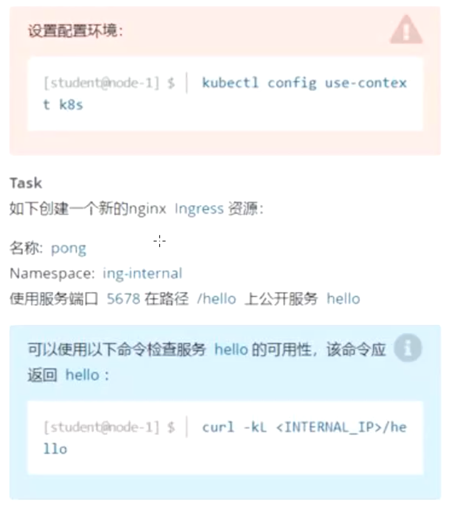

### 答案

参考: [https://kubernetes.io/zh/docs/concepts/services-networking/ingress/](https://kubernetes.io/zh/docs/concepts/services-networking/ingress/)

```bash
# 通过命令行创建yaml
kubectl -n ing-internal create ingress pong --rule=/hello=hello:5678 --dry-run=client -o yaml > ing.yaml
```


yaml文件

```yaml
apiVersion: networking.k8s.io/v1
kind: Ingress
metadata:
  name: pong
  Namespace: ing-internal
  # 这是默认的注解
  annotations:
    nginx.ingress.kubernetes.io/rewrite-target: /
spec:
# 规则
  rules:
    - http:
        paths:
        # 访问路径
          - path: /hello
            pathType: Prefix
            backend:
            # 指定service
              service:
                name: hello
                port:
                  number: 5678
```


验证

```bash
# apply
kubectl apply -f ing.yaml
# 验证
## 查看ing的ip地址(ip地址可能要等一会儿才出来)
kubectl get ing -n ing-internal
## 访问地址
curl -kL <ingress-ip>/hello
```


## 第八题 pod扩容(问题权重4%)

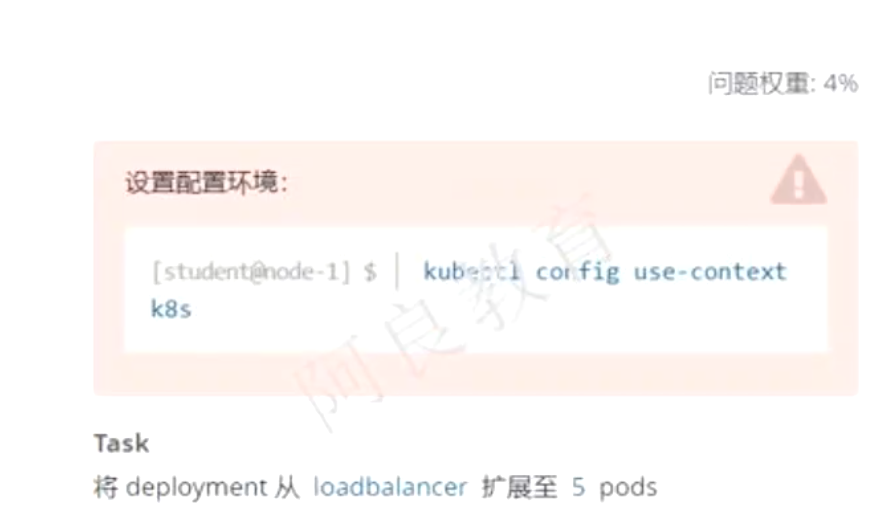

### 答案

```bash
kubectl scale deployment loadbalancer --replicas=5
```

## 第九题 nodeSelector(问题权重4%)

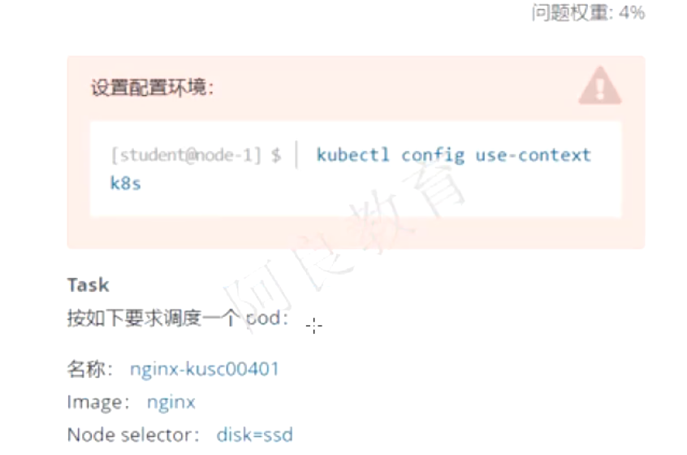

### 答案

参考 [https://kubernetes.io/zh/docs/concepts/scheduling-eviction/assign-pod-node/](https://kubernetes.io/zh/docs/concepts/scheduling-eviction/assign-pod-node/)

```yaml
apiVersion: v1
kind: Pod
metadata:
  name: nginx-kusc00401
spec:
  containers:
    - name: nginx
      image: nginx
      imagePullPolicy: IfNotPresent
  # 添加选择node,和容器字段对齐   
  nodeSelector:
    disk: ssd
```

验证

```bash
kubectl get pod nginx-kusc00401 -o wide
```


## 第十题 统计准备就绪的node数量

### 答案

```bash
# 查看下有哪些几点就绪并且没有污点
kubectl describe node|greo Taint

# 然后写入到指定的记事本中
```

## 第十一题 pod配置多容器(问题权重4%)

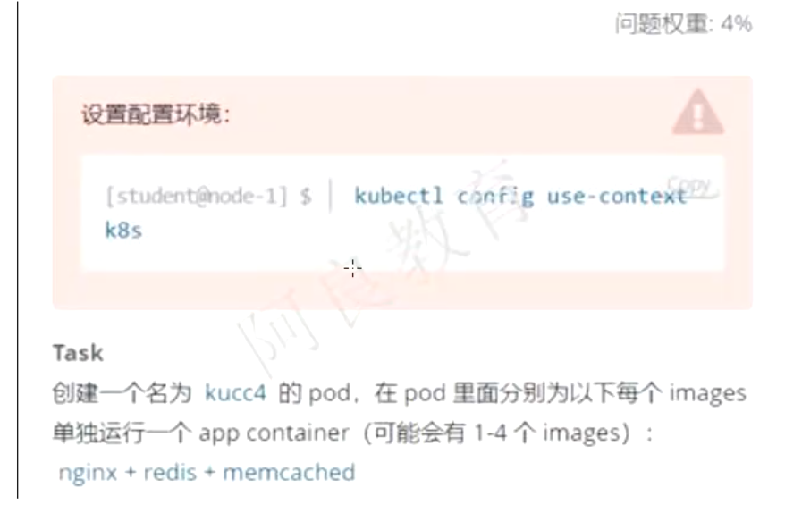

### 答案

```yaml
apiVersion: v1
kind: Pod
metadata:
  name: kucc4
spec:
  containers:
  # 配置多个容器
    - name: nginx
      image: nginx
    - name: redis
      image: redis
    - name: memcached
      image: memcached
```

## 第十二题 创建pv(问题权重4%)

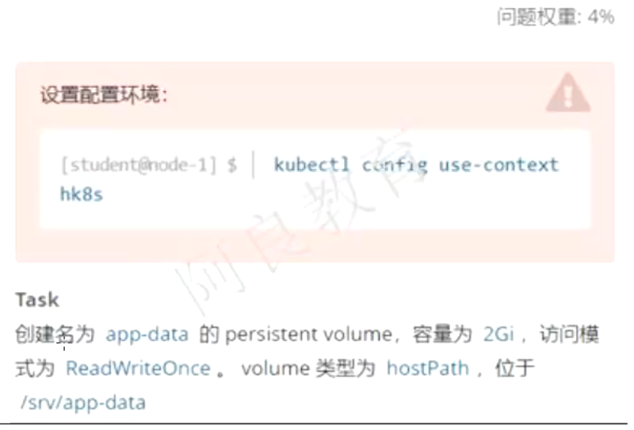

### 答案

参考: [https://kubernetes.io/zh/docs/tasks/configure-pod-container/configure-persistent-volume-storage/](https://kubernetes.io/zh/docs/tasks/configure-pod-container/configure-persistent-volume-storage/)

```yaml
apiVersion: v1
kind: PersistentVolume
metadata:
  # pv的名字
  name: app-data
spec:
  capacity:
  # 存储的大小
    storage: 2Gi
    # 读取的模式
  accessModes:
    - ReadWriteOnce
    # hostpath路径
  hostPath:
    path: “/srv/app-data”
```

验证

```bash
kubectl get pv
```

## 第十三题 pod使用pvc(问题权重7%)

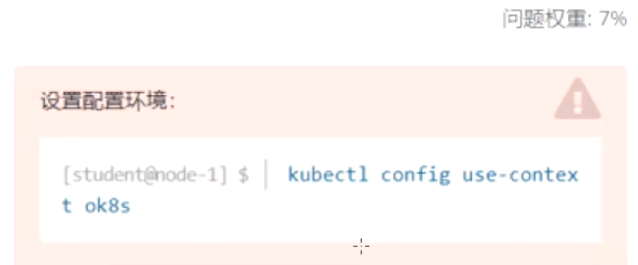

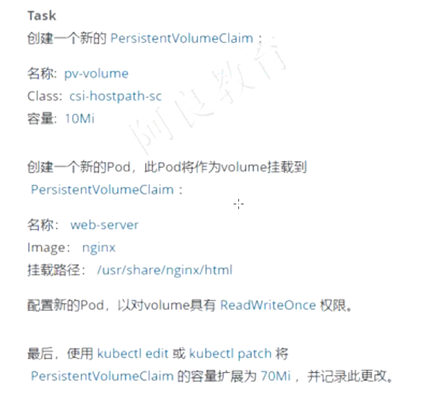

参考: [https://kubernetes.io/zh/docs/tasks/configure-pod-container/configure-persistent-volume-storage/#创建-persistentvolumeclaim](https://kubernetes.io/zh/docs/tasks/configure-pod-container/configure-persistent-volume-storage/#创建-persistentvolumeclaim)

### 答案

```yaml
---
# 创建pvc
apiVersion: v1
kind: PersistentVolumeClaim
metadata:
  # pvc名称
  name: pv-volume
# 存储类名称
spec:
  storageClassName: csi-hostpath-sc
  accessModes:
    - ReadWriteOnce
  resources:
    requests:
      storage: 10Mi

---
# 创建pod
apiVersion: v1
kind: Pod
metadata:
  # pod名称
  name: web-server
spec:
  # 使用pvc声明一个卷
  volumes:
    - name: data
      persistentVolumeClaim:
        claimName: pv-volume
  containers:
    - name: nginx
      image: nginx
      ports:
        - containerPort: 80
          name: http-server
      # 挂在卷到容器中的目录
      volumeMounts:
        - mountPath: "/usr/share/nginx/html"
          name: data
```

扩容pvc容量

```bash
# 加上--save-config会记录修改历史
kubectl edit pvc pv-volume  --save-config
```

## 第十四题 获取Pod错误日志(问题权重5%)

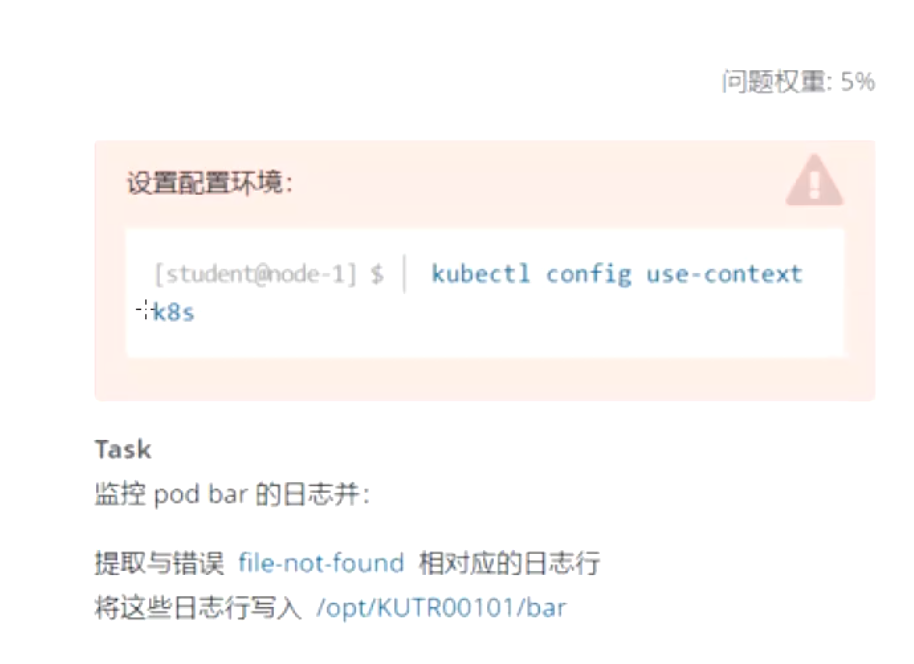

### 答案

参考: [https://kubernetes.io/zh/docs/concepts/cluster-administration/logging/](https://kubernetes.io/zh/docs/concepts/cluster-administration/logging/)

```bash
# logs查看日志
kubectl logs bar|grep file-not-found > /opt/KUTR0010/bar
```

## 第十五题 给pod添加一个边车容器(问题权重7%)

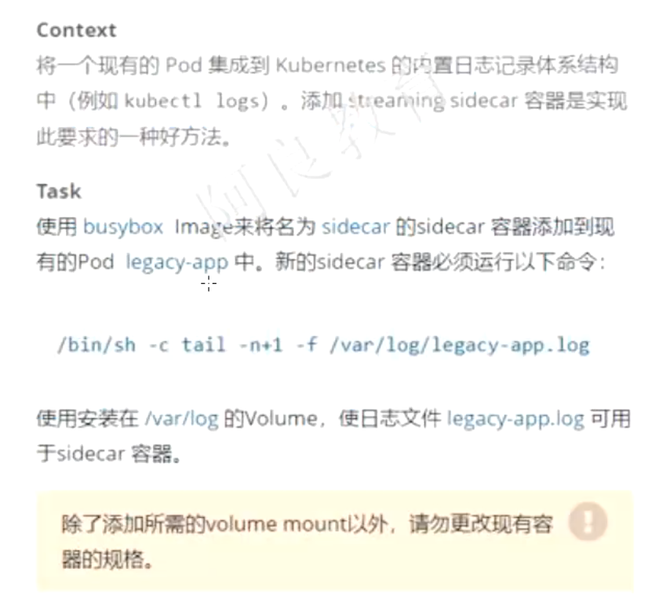

### 答案

参考 [https://kubernetes.io/zh/docs/concepts/cluster-administration/logging/#sidecar-container-with-logging-agent](https://kubernetes.io/zh/docs/concepts/cluster-administration/logging/#sidecar-container-with-logging-agent)

```bash
# 先将legacy-app这个pod导出为yaml
kubectl get pods legacy-app -o yaml > pod.yaml

# 删除legacy-app这个pod
kubectl delete pods legacy-app

# 边车容器数据共享卷使用emptydir
```

配置

```yaml
# 边车容器
apiVersion: v1
kind: Pod
metadata:
  name: legacy-app
spec:
  containers:
    - name: count
      image: busybox
      args:
        - /bin/sh
        - -c
        - >
          i=0;
          while true;
          do
            echo "$i: $(date)" >> /var/log/legacy-app.log;
            sleep 1;
          done
      # 挂载卷到容器日志目录
      volumeMounts:
        - name: varlog
          mountPath: /var/log
    # 添加边车容器
    - name: sidecar
      image: busybox
      args: [/bin/sh, -c, "tail -n+1 -f /var/log/legacy-app.log"]
      # 挂载卷到容器日志目录
      volumeMounts:
        - name: varlog
          mountPath: /var/log
  # 两个容器共享数据卷用emptyDir
  volumes:
    - name: varlog
      emptyDir: {}
```

apply这个pod的yaml

```bash
kubectl apply -f legacy-app.yaml
```

## 第十六题 统计使用CPU最高的Pod(问题权重5%)

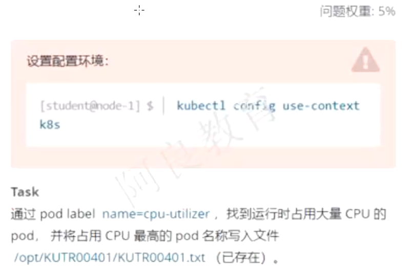

### 答案

```bash
# 按cpu使用率对pod进行排序
kubectl top pod -l name=cpu-utilizer --sort-by="cpu" -A

# 将cpu使用率第一的pod名写入到/opt/KUTR0040/KUTR00401.txt
echo "<podname>" > /opt/KUTR0040/KUTR00401.txt
```

## 第十七题 节点NotReady处理(问题权重13%)

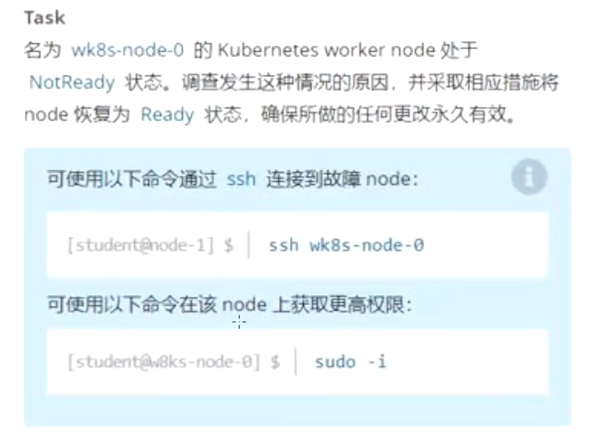

### 答案

```bash
# 查看node的状态
kubectl get nodes

# 然后ssh登陆到对应的node

# 启动对应节点上的kubelet即可
systemctl enable --now kubelet

# 回到控制台,查看node状态
kubectl get nodes
```

